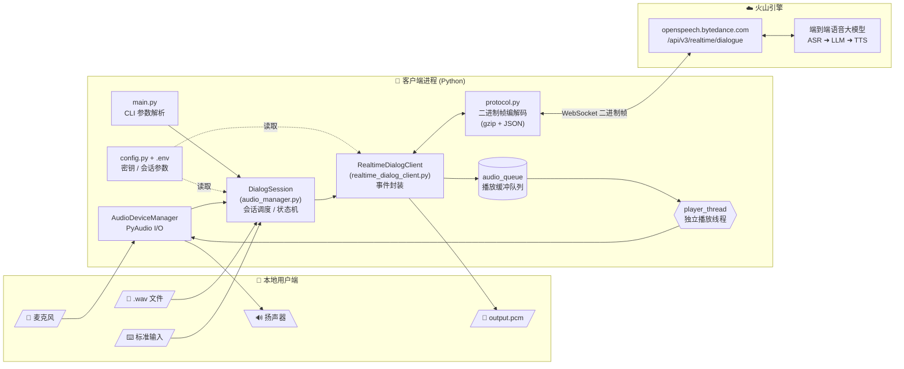
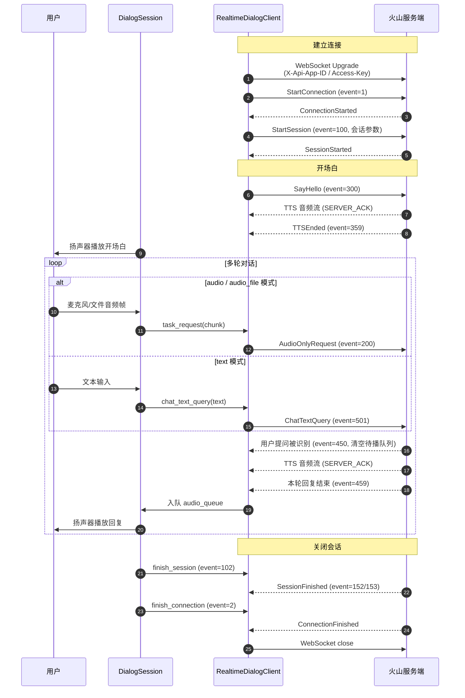

# RealtimeDialog

基于火山引擎"端到端语音大模型"（Speech-to-Speech / Omni）的实时语音对话 Demo。
通过 WebSocket 与火山服务端建立双向流式对话，支持麦克风、音频文件、纯文本三种输入方式，并实时返回语音回复。

- 官方文档：<https://www.volcengine.com/docs/6561/1594360?lang=zh>
- 协议参考：见 [protocol.py](protocol.py)

## 功能特性

- **实时语音输入 / 输出**：基于 WebSocket 流式传输，端到端低延迟。
- **多种输入模式**：
  - 麦克风实时采集（`audio` 模式，默认）
  - 本地音频文件回放（`audio_file` 模式，需指定 `--audio`）
  - 纯文本输入（`text` 模式）
- **可定制人设**：通过 `config.py` 配置 Bot 名称、系统人设、说话风格、所在城市等。
- **可切换发音人**：内置 4 个常用音色，也可使用火山控制台上的自定义复刻音色。
- **打断 / 安抚 / RAG 支持**：保留了 ChatTTSText 安抚话术、ChatRAGText 外部检索结果注入的接口示例。
- **本地落盘**：输入麦克风音频保存为 `input.pcm`，服务端返回的音频流保存为 `output.pcm`，便于复现与调试。

## 项目结构

```
volc_s2s_omni_demo/
├── main.py                    # 入口，解析命令行参数并启动 DialogSession
├── audio_manager.py           # 音频采集 / 播放 / 会话调度
├── realtime_dialog_client.py  # WebSocket 客户端，封装协议事件（StartConnection / StartSession / ChatTextQuery 等）
├── protocol.py                # 二进制协议头与响应解析
├── config.py                  # 连接配置、会话参数、音频参数
├── requirements.txt           # Python 依赖
├── .env.example               # 环境变量模板（API 密钥）
└── whoareyou.wav              # 示例音频文件
```

## 系统拓扑结构

### 组件拓扑



### 数据流

- **输入路径**：麦克风 / 音频文件 / 标准输入 ──► `DialogSession` ──► `RealtimeDialogClient` ──► gzip 压缩 + 协议头封装 ──► WebSocket 上行帧
- **输出路径**：WebSocket 下行帧 ──► `protocol.parse_response` 解析 ──► `handle_server_response` 分发：
  - 音频帧 (`SERVER_ACK`) ──► `audio_queue` ──► `player_thread` ──► 扬声器，同时累计写入 `output.pcm`
  - 控制事件 (`SERVER_FULL_RESPONSE`) ──► 更新会话状态（打断 / 静默 / 结束）
  - 错误 (`SERVER_ERROR`) ──► 抛异常退出
- **三种输入模式映射**：`audio` (麦克风实时) / `audio_file` (本地 WAV 分片回放) / `text` (stdin → ChatTextQuery)。

### 协议事件时序



### 关键事件码

| 方向 | Event | 含义 |
| --- | --- | --- |
| 客户端 ➜ 服务端 | `1` | StartConnection |
| 客户端 ➜ 服务端 | `100` | StartSession |
| 客户端 ➜ 服务端 | `102` | FinishSession |
| 客户端 ➜ 服务端 | `2` | FinishConnection |
| 客户端 ➜ 服务端 | `200` | 上传音频帧 (AudioOnlyRequest) |
| 客户端 ➜ 服务端 | `300` | SayHello（主动开场） |
| 客户端 ➜ 服务端 | `500` / `502` | ChatTTSText 安抚 / ChatRAGText 检索注入 |
| 客户端 ➜ 服务端 | `501` | 文本输入 (ChatTextQuery) |
| 服务端 ➜ 客户端 | `350` | TTS 类型反馈（`chat_tts_text` / `external_rag`） |
| 服务端 ➜ 客户端 | `359` | 一段 TTS 播报结束 |
| 服务端 ➜ 客户端 | `450` | 检测到用户开口，清空当前播放队列（打断） |
| 服务端 ➜ 客户端 | `459` | 本轮模型回复结束 |
| 服务端 ➜ 客户端 | `152` / `153` | 会话结束 |

> 协议帧结构、压缩与序列化方式详见 [protocol.py](protocol.py)。

## 环境要求

- Python 3.7+（开发时使用 3.7；当前依赖 `pydantic 2.x` 通常需要 3.8+，建议使用 3.10）
- 操作系统：Windows / macOS / Linux
- 麦克风与扬声器（仅 `audio` 模式需要）
- Windows 安装 PyAudio 前若报错，可使用 `pipwin install pyaudio` 或下载对应的 `.whl` 文件

## 快速开始

### 1. 安装依赖

```bash
pip install -r requirements.txt
```

### 2. 配置 API 密钥

复制 `.env.example` 为 `.env`，填入火山控制台上"端到端语音大模型"对应的 App ID 和 Access Key：

```bash
cp .env.example .env
```

`.env` 内容：

```
X_API_APP_ID=你的 App ID
X_API_ACCESS_KEY=你的 Access Key
```

> 注意：`.env` 已在 [.gitignore](.gitignore) 中忽略，不会被提交。

### 3. 运行

通过麦克风对话（默认模式）：

```bash
python main.py --format=pcm
```

回放本地音频文件：

```bash
python main.py --audio=whoareyou.wav
```

纯文本输入模式（输入回车后发送，超时时间最大 120s）：

```bash
python main.py --mod=text --recv_timeout=120
```

按 `Ctrl+C` 可结束会话。

## 命令行参数

| 参数 | 默认值 | 取值 | 说明 |
| --- | --- | --- | --- |
| `--format` | `pcm` | `pcm` / `pcm_s16le` | 服务端返回音频的格式 |
| `--audio` | （空） | 文件路径 | 指定后切换为音频文件输入模式 |
| `--mod` | `audio` | `audio` / `text` | 输入模式；指定 `--audio` 时自动切换为 `audio_file` |
| `--recv_timeout` | `10` | `[10, 120]` | 静默接收超时（秒），文本和音频文件模式下用于保持连接 |

## 自定义配置

在 [config.py](config.py) 中可调整以下字段：

### 发音人 `tts.speaker`

内置示例：

| Speaker ID | 描述 |
| --- | --- |
| `zh_female_vv_jupiter_bigtts` | 中文 vv 女声（默认） |
| `zh_female_xiaohe_jupiter_bigtts` | 中文 xiaohe 女声 |
| `zh_male_yunzhou_jupiter_bigtts` | 中文云洲男声 |
| `zh_male_xiaotian_jupiter_bigtts` | 中文小天男声 |

也支持：
- 自定义复刻音色 `S_XXXXXX`（需同时填写 `character_manifest`）
- 官方复刻音色，如 `ICL_zh_female_aojiaonvyou_tob`（无需填 `character_manifest`）

### 对话人设 `dialog`

```python
"dialog": {
    "bot_name": "巨思AI助手",
    "system_role": "你使用活泼灵动的女声，性格开朗，热爱生活。",
    "speaking_style": "你的说话风格简洁明了，语速适中，语调自然。",
    "location": {"city": "北京"},
}
```

可按需修改 Bot 名称、系统人设、说话风格、所在城市，或填写 `character_manifest` 给出更详细的人物设定。

### 音频参数

- 麦克风输入：16kHz / 16bit / 单声道（`input_audio_config`）
- 服务端输出：24kHz / 单声道（`output_audio_config`），位宽默认 `paFloat32`；当 `--format=pcm_s16le` 时自动切换为 `paInt16`

## 调试与产物

会话结束后，会在当前目录生成：

- `input.pcm`：最近一帧麦克风采集的原始 PCM（用于排查采集问题）
- `output.pcm`：本次会话服务端返回的全部 TTS 音频拼接，可用 `ffplay` 等工具播放校验：

  ```bash
  ffplay -f f32le -ar 24000 -ac 1 output.pcm        # --format=pcm（默认）
  ffplay -f s16le -ar 24000 -ac 1 output.pcm        # --format=pcm_s16le
  ```

控制台会打印每次请求的 `X-Tt-Logid`，便于在火山日志系统中检索。

## 常见问题

- **`ModuleNotFoundError: No module named 'pyaudio'`**：参见上方"环境要求"中的 PyAudio 安装说明。
- **`pydantic_settings.SettingsError: ... X_API_APP_ID`**：未创建 `.env` 或字段为空，参考"快速开始 / 配置 API 密钥"。
- **麦克风无声 / 服务端不响应**：检查系统默认输入设备、采样率是否被占用；可先用 `--audio=whoareyou.wav` 验证链路是否通畅。
- **`服务器错误` 报错**：通常是鉴权失败或 `X-Api-Resource-Id` / `X-Api-App-Key` 与控制台资源不匹配，核对 `.env` 与 [config.py](config.py) 的 headers。

## License

见 [LICENSE](LICENSE)。
